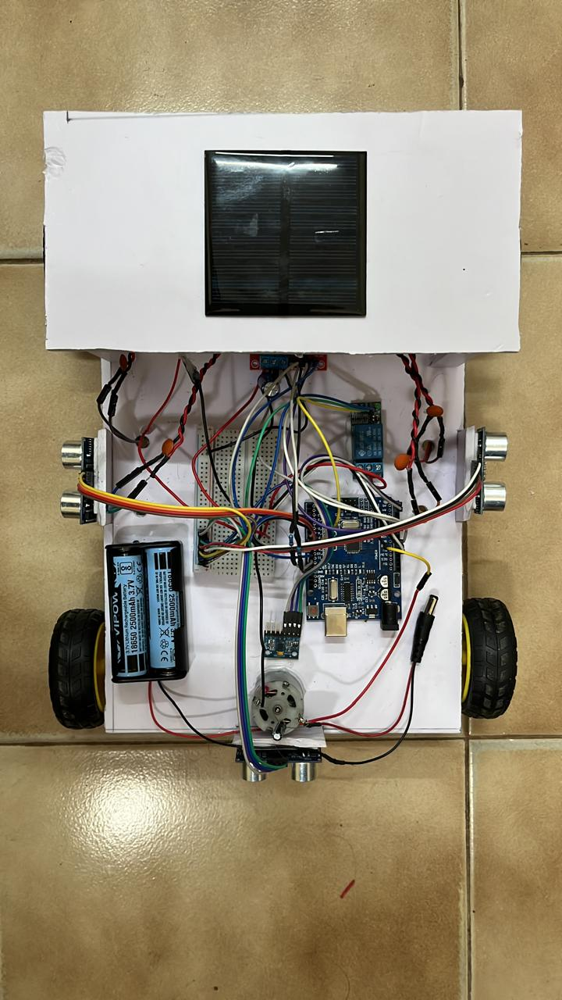
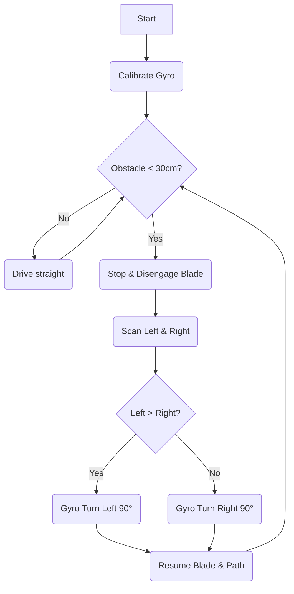

# Helios-Scythe: Gyro-Stabilized Autonomous Solar Cutter

**Helios-Scythe** is an autonomous, solar-charged vegetation management robot designed to navigate complex environments using gyroscope-assisted differential drive control.

Unlike standard obstacle-avoidance robots, this system implements **PID-based heading lock** (using an MPU6050) to maintain perfectly straight lines despite uneven terrain, and features a robust **Fault-Tolerant Architecture** to handle high-EMI environments common in high-current DC motor applications.


---

## Key Features

* **Gyro-Locked Navigation:** Uses an MPU6050 6-Axis IMU to correct motor drift in real-time using a P-Controller algorithm.
* **Brownout Protection:** Implements a custom "Soft-Start" PWM ramping algorithm to limit inrush current and prevent microcontroller resets on battery sag.
* **Fault-Tolerant I2C:** Custom timeout logic prevents system freezes if sensor vibration disconnects the I2C bus.
* **Inductive Kickback Suppression:** Hardware and software isolation (Flyback diodes + Opto-isolated relay logic) to protect the MCU from high-voltage spikes generated by the cutter motor.
* **Smart Obstacle Logic:** Uses a "Confidence Counter" (3-sample average) to filter out ultrasonic sensor noise before triggering avoidance maneuvers.

---

## Hardware Architecture

### Bill of Materials

* **Microcontroller:** Arduino Uno R3 (ATmega328P)
* **Motor Driver:** L298N Dual H-Bridge (with 1000µF Surge Capacitor)
* **IMU:** MPU6050 (3-Axis Gyro + 3-Axis Accelerometer)
* **Sensors:** 3x HC-SR04 Ultrasonic Modules (Front, Left, Right)
* **Actuators:** * 2x High-Torque DC Gear Motors (Traction)
* 1x High-RPM DC Motor (Cutter Blade)


* **Power:** * Separate logic power (7.7V Li-Ion) for MCU to ensure isolation.
* High-discharge Li-Ion pack for traction/cutter motors.



### Circuit Topology

The system utilizes a **Star Grounding Topology** to eliminate ground loops. Digital logic lines are protected via series resistors to dampen ringing caused by EMI from the brushed DC motors.

---

## Pin Configuration

| Component | Pin / Port | Notes |
| --- | --- | --- |
| **Right Motor (ENA)** | Pin 9 | PWM Speed Control |
| **Right Motor Logic** | Pin 11, 12 | **Note:** Pin 11 used to avoid Pin 13 boot-loop |
| **Left Motor (ENB)** | Pin 10 | PWM Speed Control |
| **Left Motor Logic** | A0, A1 | Analog pins used as Digital Output |
| **Relay (Cutter)** | Pin 8 | Active LOW Logic |
| **MPU6050 SDA/SCL** | A4, A5 | I2C Bus |
| **Front Sensor** | Trig: 3 / Echo: 2 | Fast-Read Mode |
| **Left Sensor** | Trig: 5 / Echo: 4 |  |
| **Right Sensor** | Trig: 7 / Echo: 6 |  |

---

## Engineering Challenges Solved

### 1. The "Brownout Loop"

* **Problem:** High-torque motors drew massive inrush current at startup, dropping battery voltage below 5V and resetting the Arduino.
* **Solution:** Implemented a software-based `moveRampped()` function that linearly interpolates PWM duty cycle (0% to 100%) over 200ms, smoothing the load curve.

### 2. Inductive EMI Crashes

* **Problem:** Disengaging the high-power cutter motor caused voltage spikes (Back EMF) that froze the microcontroller.
* **Solution:** Installed 1N5408 Flyback Diodes across motor terminals and implemented a "Safety Stop" delay in code to allow eddy currents to dissipate before the MCU resumes logic.

### 3. I2C Bus Hangs

* **Problem:** Mechanical vibrations occasionally disconnected the MPU6050 wires for microseconds, causing the `Wire` library to hang infinitely.
* **Solution:** Utilized `Wire.setWireTimeout(3000, true)` and a Watchdog Timer (WDT) to auto-reset the system if the main loop hangs for more than 1 second.

---

## Logic Flow



---

## Installation & Setup

1. Clone the repository:
```bash
git clone https://github.com/[YourUsername]/Helios-Scythe.git

```


2. Install required libraries in Arduino IDE:
* `MPU6050_light` by RFetick
* `Wire` (Built-in)
* `avr/wdt.h` (Built-in)


3. **Calibration:** Place the robot on a flat surface. Upon boot, **do not touch** the robot for 5 seconds while it calibrates the gyroscope offsets.

---

## Future Improvements

* **GPS Integration:** For geofenced mowing zones.
* **Computer Vision:** Adding an ESP32-CAM for weed recognition.
* **Solar Charging Dock:** Auto-return logic when battery voltage dips below 11.2V.

---
